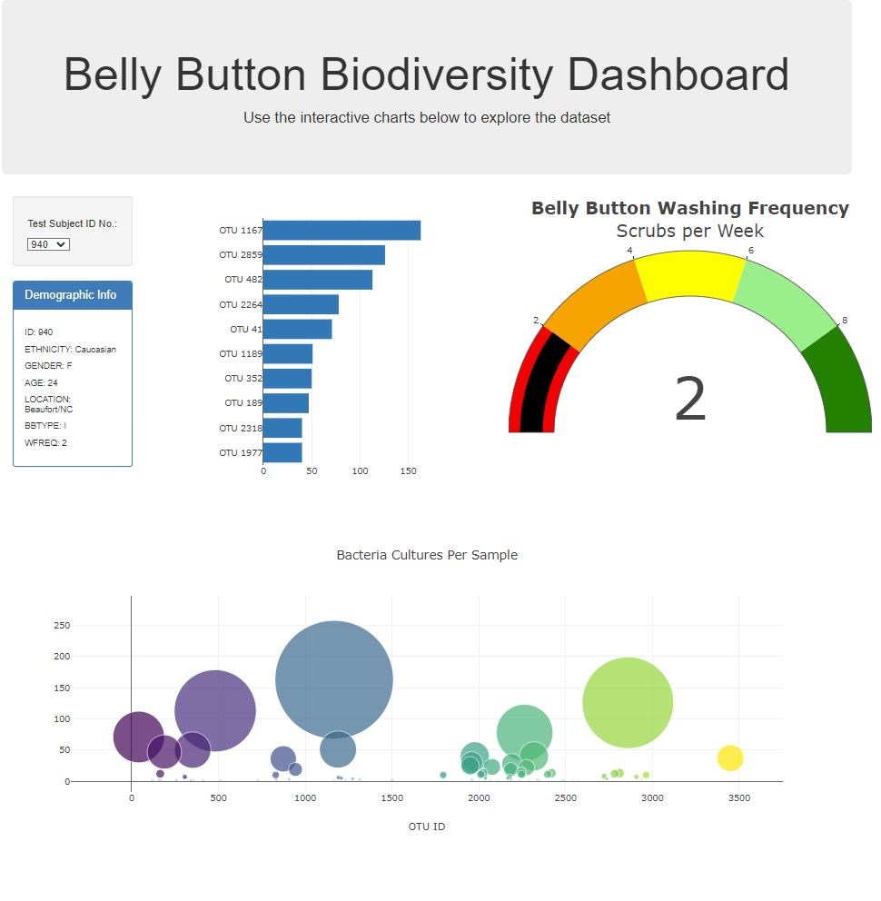
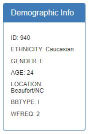
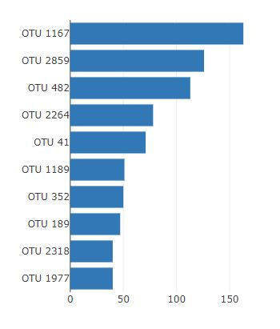
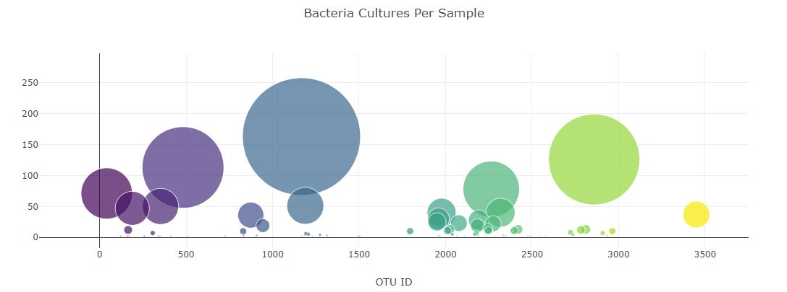
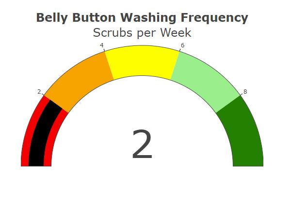

# Belly Button Biodiversity Study

To explore this study I have built an interactive dashboard to explore the [Belly Button Biodiversity dataset](http://robdunnlab.com/projects/belly-button-biodiversity/), which catalogues the microbes that colonise human navels.

The dataset reveals that a small handful of microbial species (also called operational taxonomic units, or OTUs, in the study) were present in more than 70% of people, while the rest were relatively rare.

## Instructions

Dataset: `https://2u-data-curriculum-team.s3.amazonaws.com/dataviz-classroom/v1.1/14-Interactive-Web-Visualizations/02-Homework/samples.json`.

Dependencies

- D3
- Plotly
- HTML5

In order to view dashboard, please visit the following link (The website has been loaded via github pages)

Click [here](https://rajivwick.github.io/belly-button-challenge.gitbuh.io/) to interactive with dashboard.

## Overview

The dashboard has been constructed to display multiple visualizations that are included to provide the most amount of value to the user.

### Infomation Table 

This table displays the immediate information about the selected Test Subject.

<ul>
<li>ID</li>
<li>Ethnicity</li>
<li>Gender</li>
<li>Age</li>
<li>Location</li>
<li>BBType</li>
<li>WFreq (Wash Frequency)</li>

</ul>

### Top 10 OTUs - Horizontal Bar Chart

This bar chart showcases the top 10 operational taxonomic units for quick and easy comparisons. 

### OTU Samples Values - Bubble Chart

Created to show a visualization of the sample values recorded per OTU, a bubble chart was created with the Y-axis displaying the sample value and the X-axis representing the OTU ID. 
This allows for OTU ID groupings to be easily identifiable as all as their respective performance. 

### Wash Frequency - Gauge Chart

Visually displays via a gauge chart the wash frequency of the selected Test Subject.

